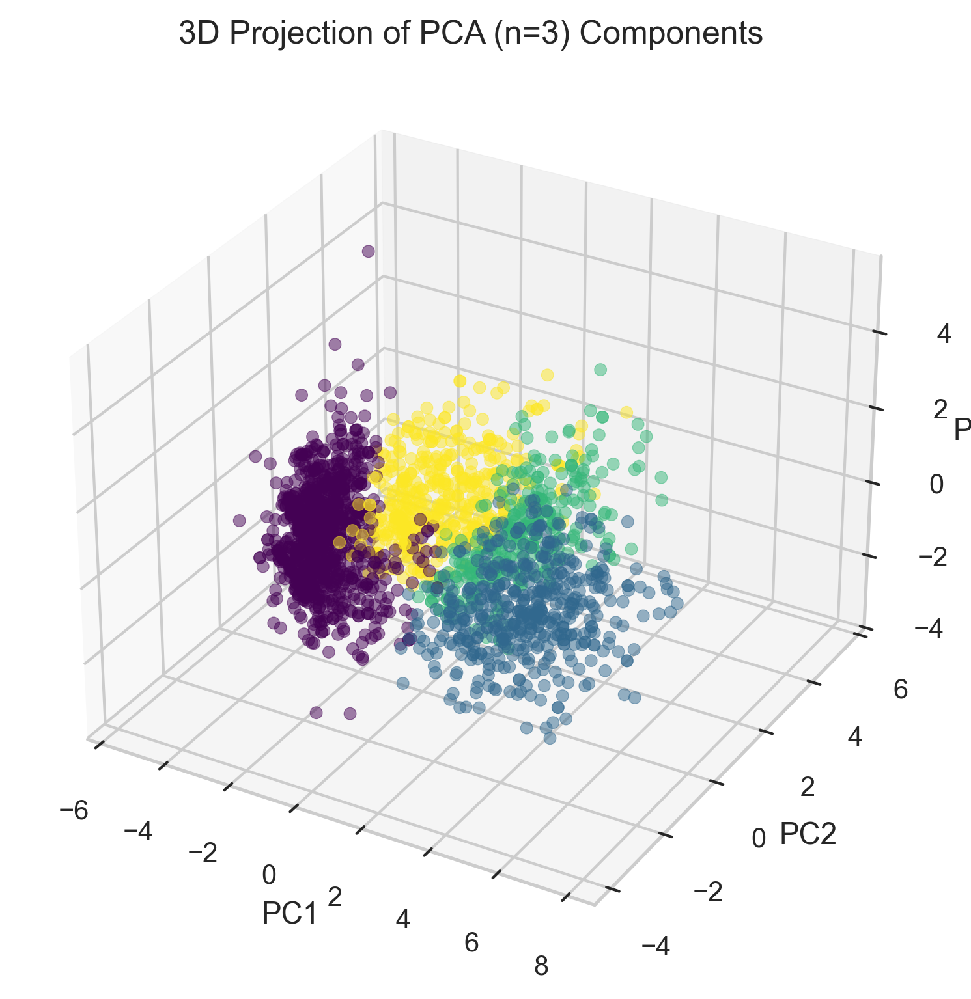
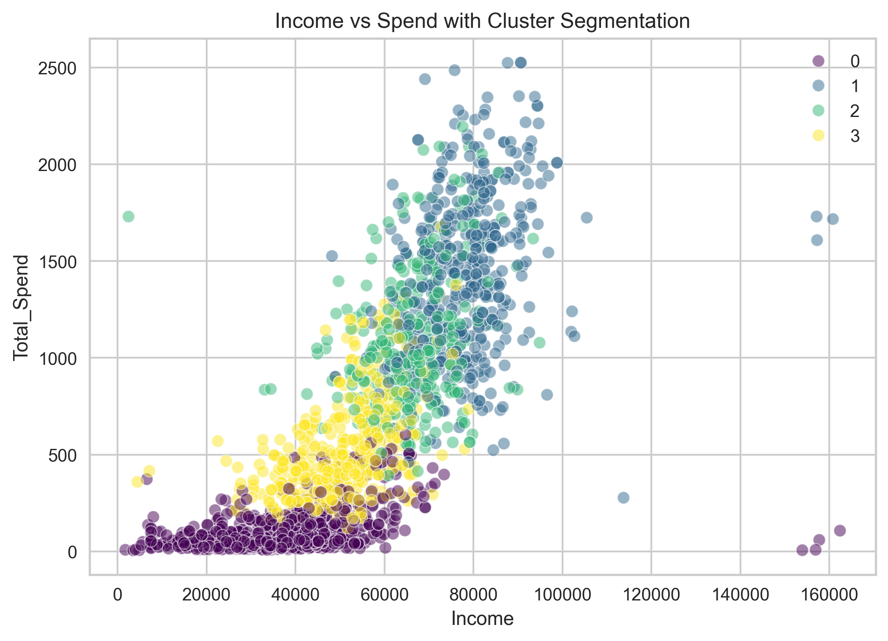
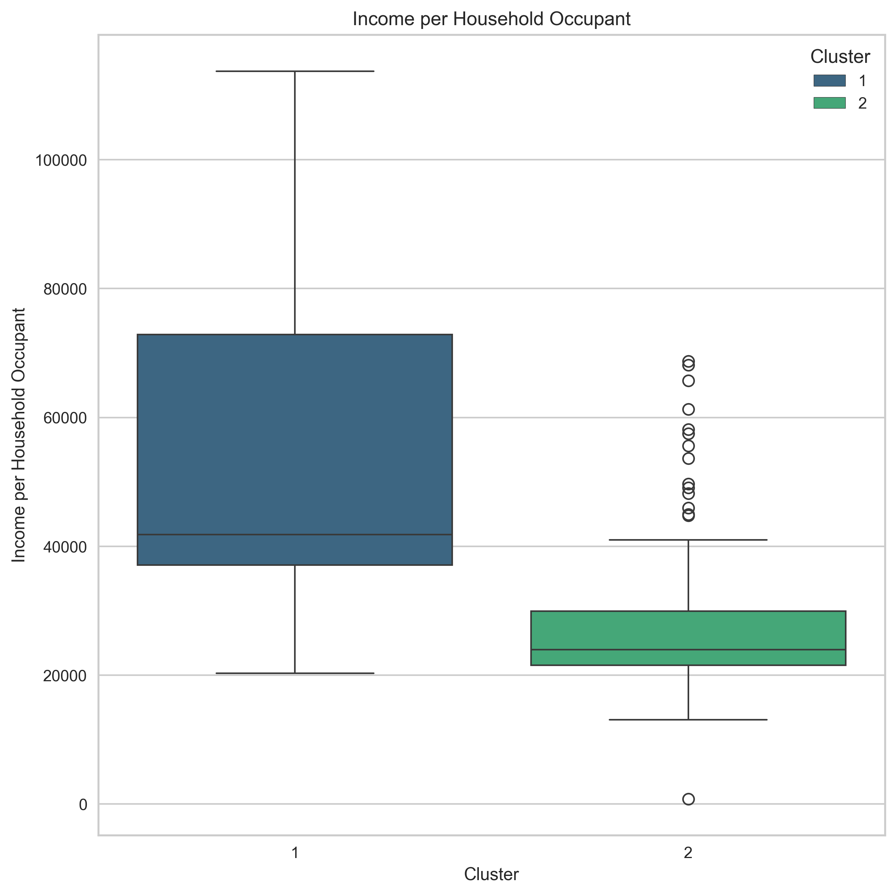

# Customer Segmentation 

## Agglomerative Clustering to Identify Customer Segments

Using Python to explore customer spending behaviour and group customers into sub-segments for targeted marketing. 

Notebook includes:

- Data Exploration and Cleaning
    * Checking dimensions & data types
    * Checking for and handling NA/missing values
    * Identifying and handling outlier values

- Feature Engineering
    * Customer Age
    * Household Occupancy
    * Customer History Length
    * Offer Campaign Utilization

- Data Preprocessing
    * Categorical feature encoding
    * Continuous feature scaling

- Feature Reduction
    * Principal Component Analysis

- Clustering
    * Validating optimal cluster count
    * Agglomerative Cluster implementation
    * Visualizing Cluster Characteristics

- Profiling
    * Examining demographic features uniting/separating clusters

- Wrap-Up & Conclusions
    * Targeted marketing initiative for each customer segment

# Main Takeaways

This dataset was condensed down into three principal components, and then split into four segments or 'Clusters'. We plotted each customer according to its position in three-dimensional principal component space, and coloured the customers by their segment/`Cluster` membership:

 

The principal components do a pretty good job separating our clusters, but each principal component itself is an orthogonal projection of correlated variance among multiple features (quite the mouthful). In this sense, we can't just look at where a customer  is in principal-component-space and immediately understand what their actual feature values might be (e.g. what their income was, or how much money they spent). So we need to 'decompose' these principal components back into the features that underly them, to help us *profile* our customer segments and understand what makes each segment different from the rest.

Income and amount of money spent seems like a good place to start,  so let's visualize that first and see if it provides us any cluster separation:

 

This  figure is a nice start; we found that the purple and yellow clusters were both lower `Income`, and separated pretty cleanly by `Total_Spend` in that purple had lower spend than yellow. Blue and Green had higher `Income` and higher `Total_Spend`, but the two groups couldn't really be reliably separated by these features. 

In a separate analysis we found that the green cluster tended to have a higher `Household_Occupancy`,  i.e. they tended to have a child in the home whereas the blue cluster tended to either be single or in a pair. This led me to believe that the household income per capita would be lower for the green cluster, because the income was spread onto supporting a child. I refer to this income-per-capita as 'spend potential', and predict to see that the blue cluster is higher than the green cluster in this new feature:

 

This suspicion was correct, we see that the blue group has much higher income per household occupant. This leads me to believe that this group is the 'highest-potential' group in that they have high income and fewer household occupants to support on that high income. These customers also tended to have a lower proportional spend on wine products than the other groups - it's possible that this group could be persuaded into increasing their wine spend by targeting them with advertisement for fancier, top-shelf wine offerings. 

 

### Segment Profiles and Marketing Strategy:

- `Cluster 0` (purple): Lowest income, lowest spend. This segment has, on average, the lowest income of all the segments. Their average spend is also the lowest, but could potentially be brought up using special discounts on some of the more affordable items.

- `Cluster 1` (blue): High income, highest spend. This customer segment has the highest income and tends not to have children, meaning their spend potential is the highest out of the customer base. This is a very high-value segment of the customer base. Interestingly they spend relatively less on wines - they may appreciate a higher selection or targeted deals on some of the upper-shelf wine options.

- `Cluster 2` (green): High income, tends to have children, less spend than other high-income groups. This group has decent income but has less spend potential due to higher household occupancy. Targeted marketing for households with children/teenagers could be helpful in bringing spend up for this customer segment.

- `Cluster 3` (yellow): Low income, moderate spend. This group has higher spend than the other low-income customer group, meaning they may be approaching their 'spend ceiling' and have lower spend potential. It's unclear whether targeted marketing would be effective in increasing the spend of this customer segment.

 

# Thanks for reading!

-Brendan
